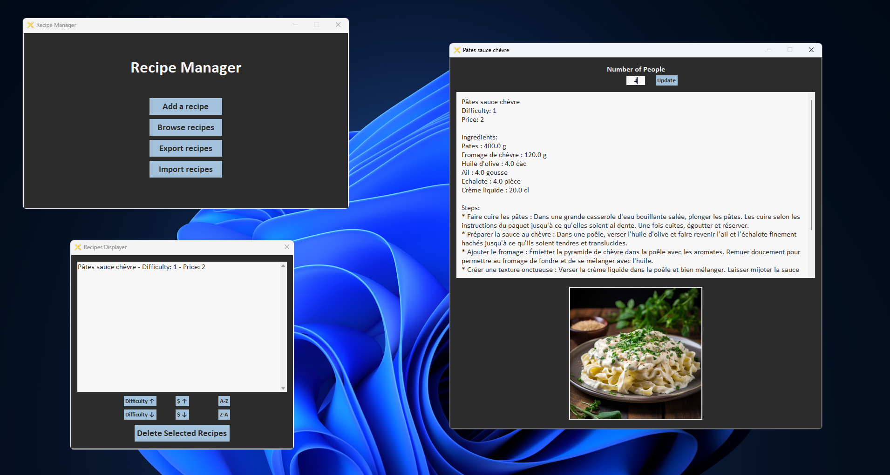

# Recipe Manager - Python Application

This project is a recipe management application developed in Python using Tkinter for the graphical interface and JSON for data storage. It allows users to create, manage, and import/export to share recipes. The application includes features like ingredient and step management, difficulty and price rating, and encoding images in Base64 format to store them in a JSON file.



## Features

- **Add Recipes**: Create new recipes with name, ingredients, steps, difficulty, price, and an image (optional).
- **Import/Export Recipes**: Share your recipes with friends by exporting them to a JSON file, which can be imported by others.
- **Image Encoding**: Encode images in Base64 and store them in the JSON file to keep everything in a single file.
- **Recipe Management**: Browse, display, edit and sort your recipes.

## Requirements

- Python 3.7 or higher
- Tkinter (comes pre-installed with Python)
- `base64` for image encoding (part of Python's standard library)

## Installation

1. **Clone the repository:**

   Open your terminal in the directory of your choice and run the following command:

   ```bash
   git clone https://github.com/Nayrhode/recipe-manager.git
   cd recipe-manager

2. **exe packaging (example with pyInstaller):**

   You can package it using pyInstaller:

   ```bash
   pyinstaller --noconfirm --onefile --windowed --icon "resources\Fork_Knife.ico" --name "Recipe Manager" --add-data "resources:resources/"  main.py